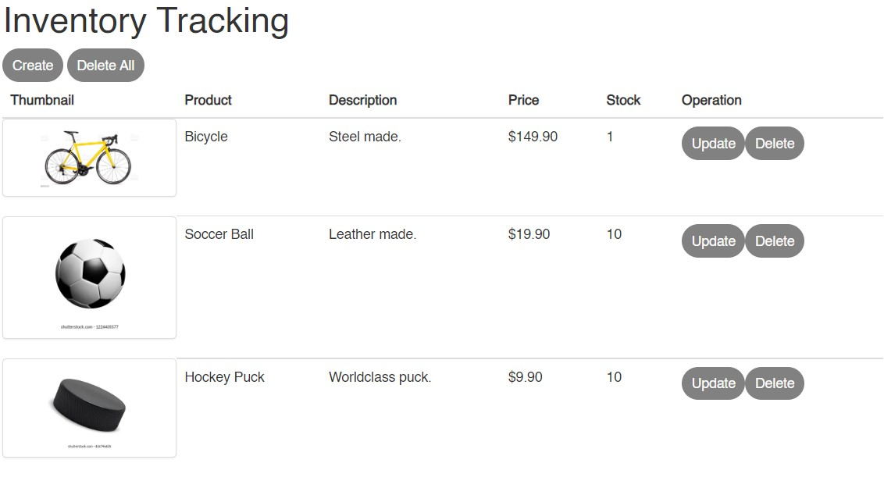

# Inventory Tracking

This web app provides a systematic way to track inventory.

## How to use it:

  1. Open https://inventorytracking.gvfcom.repl.co/ or Download the repository.
      1. For Download, open index.html with a web browser (Brave, Chrome, Firefox, Opera, Safari...)
  
  2. Use functionalities as you wish:
    - **Create inventory items**: press the "Create" button, fill the formulary until it's not yellow in any field, and press "Create" again.
    - **Edit Them**: press the "Update" button on the corresponding table row, fill the formulary making sure there's no yellow field, and press "Update" beneath the formulary.
    - **Delete Them**: press the "Delete" button, press the "OK" alert box button, fill in the delete comment alert field, and press "OK".
    - **View a list of them**: automatically shown.
    - **Undeletion**: press the "Undelete" button on the corresponding table row.
  
All feedback is appreciated. Enjoy!
